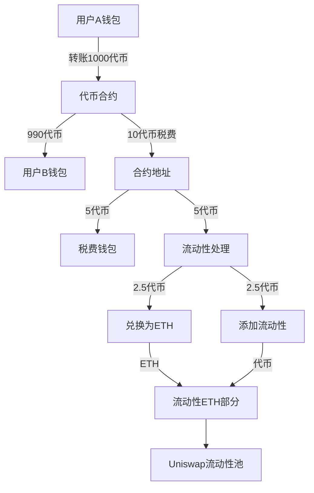
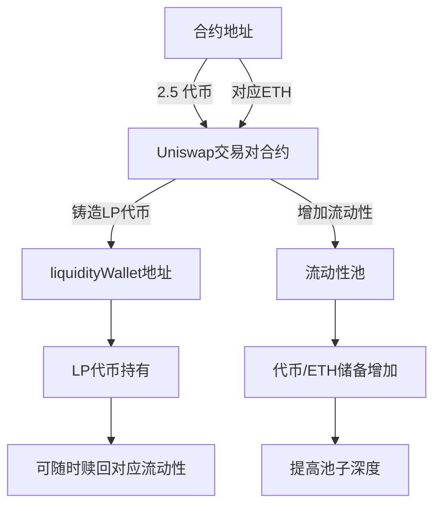

### 用户转账资金流转图及函数调用流程

#### 转账场景假设
用户A → 用户B 转账 1000 个代币

转账税率：1%（10个代币）

流动性分配比例：50%

#### 资金流转图

#### 完整的资金和LP代币流转图


#### 详细函数调用流程
##### 1. 用户发起转账

```solidity
// 用户调用（前端或钱包触发）
token.transfer(userB, 1000);

```
##### 2.合约内部调用链
###### 2.1 transfer 函数（公共入口）

```solidity
function transfer(address to, uint256 amount) 
    public 
    virtual
    override 
    tradingCheck(msg.sender, to)
    returns (bool) 
{
    return _tokenTransfer(msg.sender, to, amount);
}
```

###### 2.2 _tokenTransfer 函数（核心逻辑）

```solidity
function _tokenTransfer(address from, address to, uint256 amount) private returns (bool) {
    // 验证交易限制
    _validateTransfer(from, to, amount);
    
    // 计算税费 (1000 * 1% = 10 代币)
    uint256 taxAmount = _calculateTaxAmount(from, to, amount);
    uint256 transferAmount = amount - taxAmount; // 990 代币
    
    // 执行主转账 (990 代币)
    _transfer(from, to, transferAmount);
    
    // 转移税费到合约 (10 代币)
    _transfer(from, address(this), taxAmount);
    
    // 处理税费分配
    _processTax(taxAmount);
    
    // 更新交易时间
    _updateTradeTime(from, to);
    
    return true;
}
```

###### 2.3 _validateTransfer 函数（限制检查）

```solidity
function _validateTransfer(address from, address to, uint256 amount) private view {
    // 检查交易量限制
    require(amount <= maxTransactionAmount, "Transfer amount exceeds max transaction");
    
    // 检查持仓量限制
    if (to != uniswapV2Pair && to != address(0)) {
        uint256 newBalance = balanceOf(to) + amount;
        require(newBalance <= maxWalletBalance, "Wallet balance exceeds max wallet");
    }
    
    // 检查交易冷却时间
    if (from != uniswapV2Pair && !_isExcludedFromLimits[from]) {
        require(
            block.timestamp >= _lastTradeTime[from] + tradeCooldown,
            "Trade cooldown not expired"
        );
    }
}
```

###### 2.4 _calculateTaxAmount 函数（税费计算）
```solidity
function _calculateTaxAmount(address from, address to, uint256 amount) private view returns (uint256) {
    // 普通转账使用 transferTaxRate (1%)
    return _calculateTax(amount, transferTaxRate); // 1000 * 100 / 10000 = 10 代币
}

function _calculateTax(uint256 amount, uint256 taxRate) private pure returns (uint256) {
    return amount * taxRate / 10000;
}
```

###### 2.5 _processTax 函数（税费处理）

```solidity

function _processTax(uint256 taxAmount) private {
    uint256 contractTokenBalance = balanceOf(address(this));
    
    // 检查是否触发自动流动性添加
    if (
        contractTokenBalance >= minTokensForLiquidity &&
        !inSwapAndLiquify &&
        msg.sender != uniswapV2Pair &&
        autoLiquidityEnabled
    ) {
        _addLiquidityAutomatically(minTokensForLiquidity);
    } else {
        // 如果未触发自动流动性，直接分配税费
        _distributeTax(taxAmount);
    }
}
```

###### 2.6 _distributeTax 函数（税费分配）
```solidity
function _distributeTax(uint256 taxAmount) private {
    // 计算分配比例 (10 * 50% = 5 代币)
    uint256 liquidityAmount = taxAmount * liquidityTaxRatio / 10000; // 5 代币
    uint256 taxWalletAmount = taxAmount - liquidityAmount; // 5 代币
    
    // 转移给税费钱包
    if (taxWalletAmount > 0) {
        _transfer(address(this), taxWallet, taxWalletAmount); // 5 代币
    }
    
    // 处理流动性部分
    if (liquidityAmount > 0) {
        _addLiquidityAutomatically(liquidityAmount); // 5 代币
    }
    
    emit TaxDistributed(taxAmount, liquidityAmount, taxWalletAmount);
}

```

###### 2.7 _addLiquidityAutomatically 函数（自动添加流动性）

```solidity
function _addLiquidityAutomatically(uint256 tokenAmount) private lockTheSwap {
    // 将代币分成两半 (5 / 2 = 2.5 代币)
    uint256 half = tokenAmount / 2; // 2.5 代币
    uint256 otherHalf = tokenAmount - half; // 2.5 代币
    
    // 将一半代币兑换为ETH
    uint256 initialBalance = address(this).balance;
    _swapTokensForEth(half); // 2.5 代币 → ETH
    
    // 计算兑换得到的ETH数量
    uint256 newBalance = address(this).balance - initialBalance;
    
    // 添加流动性
    _addLiquidity(otherHalf, newBalance); // 2.5 代币 + ETH
    
    emit SwapAndLiquify(half, newBalance, otherHalf);
}
```

###### 2.8 _swapTokensForEth 函数（代币兑换ETH）
```solidity
function _swapTokensForEth(uint256 tokenAmount) private {
    address[] memory path = new address[](2);
    path[0] = address(this);
    path[1] = uniswapV2Router.WETH();
    
    _approve(address(this), address(uniswapV2Router), tokenAmount);
    
    uniswapV2Router.swapExactTokensForETHSupportingFeeOnTransferTokens(
        tokenAmount,
        0, // 接受任何数量的ETH
        path,
        address(this),
        block.timestamp
    );
}
```


###### 2.9 _addLiquidity 函数（添加流动性）
```solidity
function _addLiquidity(uint256 tokenAmount, uint256 ethAmount) private {
    _approve(address(this), address(uniswapV2Router), tokenAmount);
    
    uniswapV2Router.addLiquidityETH{value: ethAmount}(
        address(this),
        tokenAmount,
        0, // 滑点保护
        0, // 滑点保护
        liquidityWallet, // 流动性代币发送到流动性钱包
        block.timestamp
    );
}
```


###### 2.10 _updateTradeTime 函数（更新交易时间）
```solidity
function _updateTradeTime(address from, address to) private {
    // 记录用户A的最后交易时间
    _lastTradeTime[from] = block.timestamp;
}
```


##### 最终资金分配结果
参与方	代币变化	ETH变化	说明
用户A	-1000 代币	0 ETH	发起转账
用户B	+990 代币	0 ETH	收到转账（扣除税费后）
税费钱包	+5 代币	0 ETH	用于项目开发/营销
流动性池	+2.5 代币	+对应ETH	添加到流动性池的代币部分
流动性提供者	获得LP代币	获得LP代币	流动性钱包获得LP代币


发布合约（构造函数 先给合约部署人 mint 一定数量得代币 并且创建流动性池（此时池是空的））

然后创始人需要（通过 Uniswap Router）调用founderAddInitialLiquidity（激活流动性池）

##### 流动性启动的正确顺序：
部署合约 - 代币分配给部署者

手动创建流动性 - 创始人调用 addLiquidityETH （Uniswap 交互界面来完成）

启用交易 - 设置 tradingEnabled = true

税费积累 - 用户交易产生税费，存入合约地址

自动流动性 - 当 balanceOf(address(this)) 达到阈值时自动添加流动性